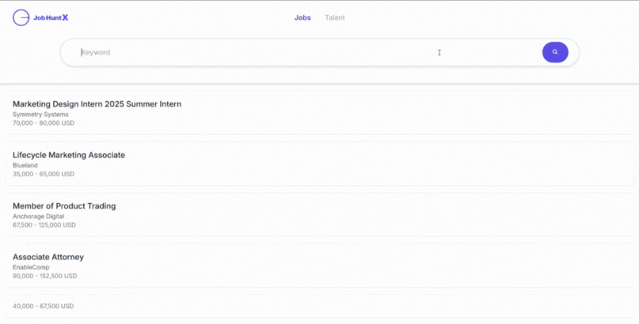

# JobHuntX




[🚀 **パブリックデモ**](https://jobhuntx.onrender.com/)

## 概要
JobHuntX は、ASP.NET Core と React を使用して開発された求人情報集約アプリケーションです。このプロジェクトは、公開API・RSS・Webサイトなど複数の情報源から求人情報を収集し、効率的に求人情報を管理・検索するためのツールを提供します。

## 主な機能
- 求人情報の収集（API・RSS・Webサイト等）
- 検索およびフィルタリング機能
- ユーザーフレンドリーなインターフェース
- CI/CDパイプライン

## セットアップ
1. リポジトリをクローンします:
    ```bash
    git clone https://github.com/your-repository/JobHuntX.git
    ```
1. 環境変数ファイルをセットアップします:
    ```bash
    cp JobHuntX.API/.env.sample JobHuntX.API/.env
    cp client-app/.env.sample client-app/.env
    ```
1. API クライアントを生成します:
    ```bash
    cd JobHuntX/JobHuntX.API
    dotnet nswag run nswag.local.json
    ```
1. Docker Compose を使用してアプリケーションを起動します:
    ```bash
    cd ../
    docker-compose up --build
    ```
1. アプリケーションが起動したら、以下の URL にブラウザでアクセスします:
    ```
    http://localhost:5173
    ```

## 技術スタック

### 🧱 コア技術


### 🛠️ ツール & ユーティリティ


## dotnet-formatでのフォーマット

`JobHuntX.API` プロジェクトは `dotnet-format` コマンドを使用してフォーマットを整形できます:

```bash
$ cd JobHuntX.API
$ dotnet tool run dotnet-format
```

## NSwagでのAPI型生成

モデルを変更した後、`nswag` を使用してフロントエンド側のAPI型を自動生成できます:

```bash
$ cd ./JobHuntX.API
$ dotnet nswag run nswag.local.json
```

## プルリクエスト作成前の注意

プルリクエストを作成する前に、**CIテストが通るよう必ずローカルの `swagger.json` を最新化してください**:

```bash
$ docker-compose up -d
$ dotnet run --project JobHuntX.API & curl http://localhost:5000/swagger/v1/swagger.json > JobHuntX.API/swagger.json
```

これにより、フロントエンドのAPI型が最新のAPI仕様から生成され、CIテストが `swagger.json` の不足や古さで失敗しなくなります。

## テストの実行

クライアント側のテストは以下のコマンドで実行できます:

```bash
$ cd client_app
$ pnpm test
```

バックエンドのテストは `JobHuntX.Tests` プロジェクトを使って実行できます:

```bash
$ dotnet test JobHuntX.Tests
```

## デプロイ

パブリックデモは Render サービス上で `release/render-deploy` ブランチおよび `Dockerfile.render` を使用してデプロイされています。

- **デモURL:** https://jobhuntx.onrender.com/
- **デプロイ用ブランチ:** `release/render-deploy`
- **Dockerfile:** `Dockerfile.render`

## ライセンス
このプロジェクトは [MIT ライセンス](./LICENSE) の下で提供されています。
