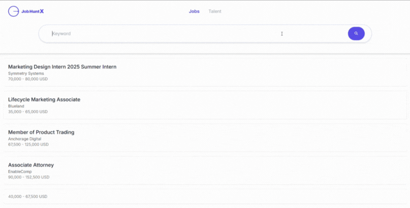
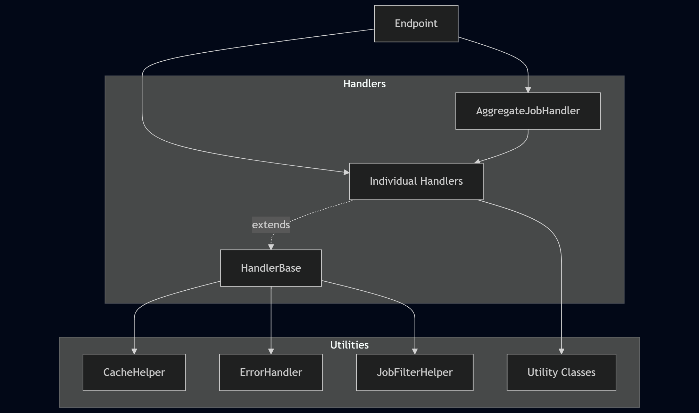
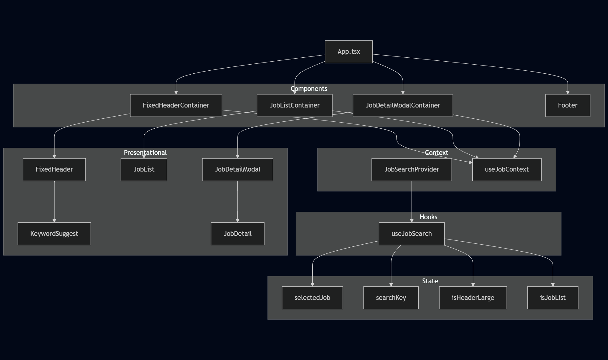

# JobHuntX

English | [日本語](README.ja.md)




[🚀 **Public Demo is Live!**](https://jobhuntx.onrender.com/)

## Overview
JobHuntX is a job information aggregation application developed using ASP.NET Core and React. This project collects job postings from multiple sources—including public APIs, RSS feeds, and websites—and provides tools to efficiently search job information.

## Key Features
- Job information aggregation (from APIs, RSS feeds, and websites)
- Search and filtering functionality
- User-friendly interface
- Automated CI/CD pipeline

## Setup
1. Clone the repository:
    ```bash
    git clone https://github.com/your-repository/JobHuntX.git
    ```
1. Run the initialization script (sets up env variables and restores dependencies):
    ```bash
    npm run init
    ```
1. Start the application using Docker Compose:
    ```bash
    docker compose up --build -d
    ```
1. Once the application starts, access the following URL in your browser:
    ```
    http://localhost:5173
    ```

## Development Commands

Human designers mainly use these three commands:

| Command | Description |
| :--- | :--- |
| `npm run init` | One-time setup (environment, dependencies) |
| `npm run dev` | Start the entire application |
| `npm run validate` | **Final check before submission (Lint + Type Check + Test)** |

Other detailed operations (API sync, code formatting) are handled autonomously by the AI agent.

## Development Workflow

1.  **Start Development**: Use `npm run dev` to start the app and provide instructions while checking behavior in the browser.
2.  **API Synchronization**: When the AI modifies the backend, it autonomously runs `npm run sync` to reflect types in the frontend.
3.  **Quality Verification**: Run `npm run validate` before finishing a task or creating a PR to ensure project-wide consistency.

## Tech Stack

### 🧱 Core Technologies


### 🛠️ Tooling & Utilities


## Deployment

The public demo is deployed on Render using the `release/render-deploy` branch and the `Dockerfile.render` configuration.

- **Demo URL:** https://jobhuntx.onrender.com/
- **Deployment branch:** `release/render-deploy`
- **Dockerfile:** `Dockerfile.render`

## Architecture

### **Backend**

This application organizes backend data retrieval and processing logic using the "Handler" pattern.



#### Components

* HandlerBase (abstract class):  
    Provides common functionality (caching, error handling, filtering, etc.) and serves as a base for concrete handlers.
* Individual Handlers  
    Concrete classes that handle job fetching and parsing from individual sources (e.g., RSS, API, websites).
* AggregateJobHandler  
    Integrates multiple Individual Handlers to build a unified job list.
* Utilities  
    Cross-cutting concerns such as caching, logging, and filtering are encapsulated in separate utility classes to ensure reusability and single responsibility.

### **Frontend**

The frontend is structured using a combination of the **Container/Presentational pattern** and **state management with Hooks + Context**. The main goal is to achieve separation of concerns, improving readability and scalability.



#### Components

* Hooks  
    * useJobSearch:  
    Centralizes management of search state, selected job, header size, and display mode (job/talent). Also handles side effects such as API calls.
* State  
    State values managed by useJobSearch, shared across multiple components.
* Context  
    * JobSearchProvider:  
    Wraps state in context, making it accessible to child components.
    * useJobContext:  
    Custom hook for concise access and updates to state.
* Container Components  
    * XXXContainer:  
    Handles state and logic (context access, handler definitions), passing necessary props to presentational components.
* Presentational Components  
    * XXX:  
    UI components focused solely on display and user interaction, without logic or side effects.
* App.tsx  
    The entry point of the application. It wraps the app with ```JobSearchProvider``` and composes the top-level container components.

## License
This project is provided under the [MIT License](./LICENSE).
