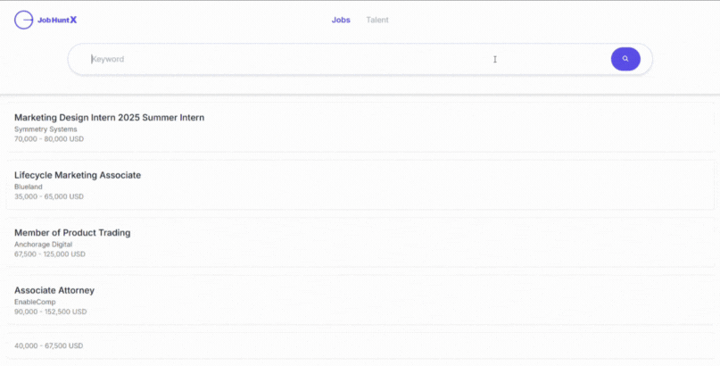

# JobHuntX




[🚀 **Public Demo is Live!**](https://jobhuntx.onrender.com/)

## Overview
JobHuntX is a job information aggregation application developed using ASP.NET Core and React. This project collects job postings from multiple sources—including public APIs, RSS feeds, and websites—and provides tools to efficiently search job information.

## Key Features
- Job information aggregation (from APIs, RSS feeds, and websites)
- Search and filtering functionality
- User-friendly interface
- Automated CI/CD pipeline

## Setup
1. Clone the repository:
    ```bash
    git clone https://github.com/your-repository/JobHuntX.git
    ```
1. Set up environment variables:
      ```bash
      cp JobHuntX.API/.env.sample JobHuntX.API/.env
      cp client-app/.env.sample client-app/.env
      ```
1. Generate the API client:
    ```bash
    cd JobHuntX/JobHuntX.API
    dotnet nswag run nswag.local.json
    ```
1. Start the application using Docker Compose:
    ```bash
    cd ../
    docker-compose up --build
    ```
1. Once the application starts, access the following URL in your browser:
    ```
    http://localhost:5173
    ```

## Tech Stack

### 🧱 Core Technologies


### 🛠️ Tooling & Utilities


## Formatting with dotnet-format

You can format the `JobHuntX.API` project using the `dotnet-format` command:

```bash
$ cd JobHuntX.API
$ dotnet tool run dotnet-format
```

## Generating API Types with NSwag

After modifying models, you can use `nswag` to automatically define API types for the frontend:

```bash
$ cd ./JobHuntX.API
$ dotnet nswag run nswag.local.json
```

## Running Tests

You can run client-side tests with:

```bash
$ cd client_app
$ pnpm test
```

You can also run backend tests using the `JobHuntX.Tests` project:

```bash
$ dotnet test JobHuntX.Tests
```

## Before Creating a Pull Request

Before creating a pull request, **be sure to update the local `swagger.json`** for CI tests to pass:

```bash
$ docker-compose up -d
$ curl http://localhost:5000/swagger/v1/swagger.json > JobHuntX.API/swagger.json
```

This ensures that the frontend API types can be generated from the latest API specification and that CI tests will not fail due to missing or outdated `swagger.json`.

## Deployment

The public demo is deployed on Render using the `release/render-deploy` branch and the `Dockerfile.render` configuration.

- **Demo URL:** https://jobhuntx.onrender.com/
- **Deployment branch:** `release/render-deploy`
- **Dockerfile:** `Dockerfile.render`

## Architecture

### **Backend**

This application organizes backend data retrieval and processing logic using the "Handler" pattern.


#### Components

* HandlerBase (abstract class):  
    Provides common functionality (caching, error handling, filtering, etc.) and serves as a base for concrete handlers.
* Individual Handlers  
    Concrete classes responsible for each job source.
* AggregateJobHandler  
    Integrates multiple Individual Handlers to build a unified job list.
* Utilities  
    Cross-cutting concerns (caching, logging, filtering, utilities) are separated into independent classes to ensure reusability and single responsibility.

### **Frontend**

The frontend is structured using a combination of the **Container/Presentational pattern** and **state management with Hooks + Context**. The main goal is to achieve separation of concerns, improving readability and scalability.


#### Components

* Hooks  
    * useJobSearch:  
    Centralizes management of search state, selected job, header size, and display mode (job/talent). Also handles side effects such as API calls.
* State  
    State values managed by useJobSearch, shared across multiple components.
* Context  
    * JobSearchProvider:  
    Wraps state in context, making it accessible to child components.
    * useJobContext:  
    Custom hook for concise access and updates to state.
* Container Components  
    * XXXContainer:  
    Handles state and logic (context access, handler definitions), passing necessary props to presentational components.
* Presentational Components  
    * XXX:  
    UI components focused solely on display and user interaction, without logic or side effects.
* App.tsx  
    The entry point of the application, providing state via JobSearchProvider and arranging main container components.

## License
This project is provided under the [MIT License](./LICENSE).
