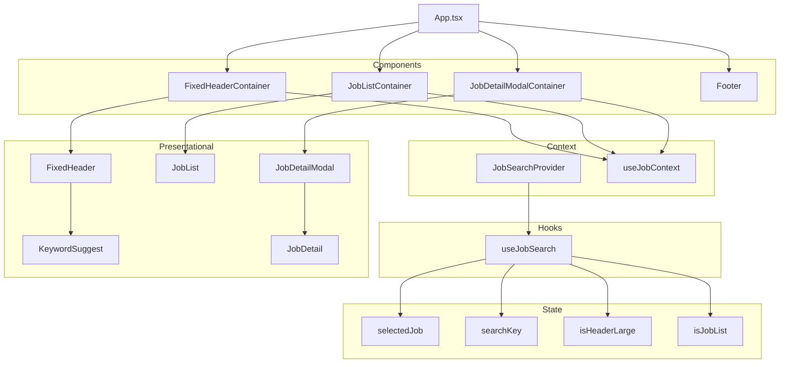
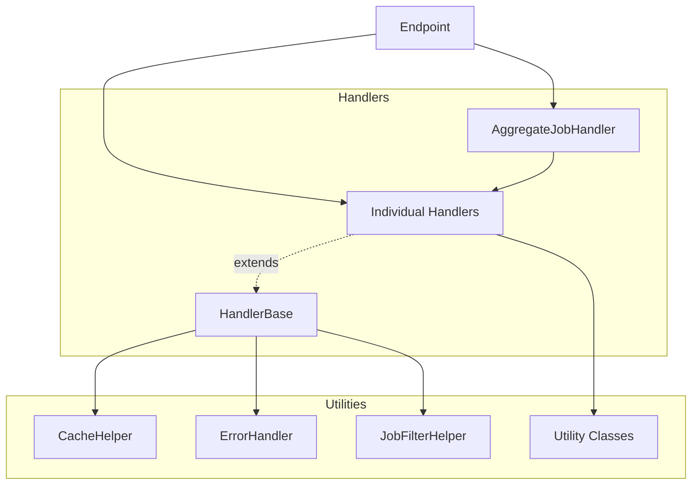

<!-- https://mermaid.live/ -->

* forntend

```mermaid
flowchart TD
  subgraph Hooks
    H1[useJobSearch]
  end

  subgraph State
    S1[selectedJob]
    S2[searchKey]
    S3[isHeaderLarge]
    S4[isJobList]
  end

  subgraph Context
    C1[JobSearchProvider]
    C2[useJobContext]
  end

  subgraph Components
    B1[FixedHeaderContainer]
    B2[JobListContainer]
    B3[JobDetailModalContainer]
    B4[Footer]
  end

  subgraph Presentational
    P1[FixedHeader]
    P5[KeywordSuggest]
    P2[JobList]
    P3[JobDetailModal]
    P4[JobDetail]
  end

  A1[App.tsx]

  A1 --> B1
  A1 --> B2
  A1 --> B3
  A1 --> B4

  B1 --> P1
  B2 --> P2
  B3 --> P3
  P1 --> P5
  P3 --> P4

  H1 --> S1
  H1 --> S2
  H1 --> S3
  H1 --> S4

  B1 --> C2
  B2 --> C2
  B3 --> C2

  C1 --> H1

```

* backend

```mermaid
flowchart TD
  subgraph Handlers
    B[Individual Handlers]
    C[AggregateJobHandler]
    D[HandlerBase]
  end
  A[Endpoint] --> B
  A[Endpoint] --> C
  C --> B
  B -.->|extends| D
  subgraph Utilities
    E[CacheHelper]
    F[ErrorHandler]
    G[JobFilterHelper]
    H[Utility Classes]
  end
  B --> H
  D --> E
  D --> F
  D --> G
```